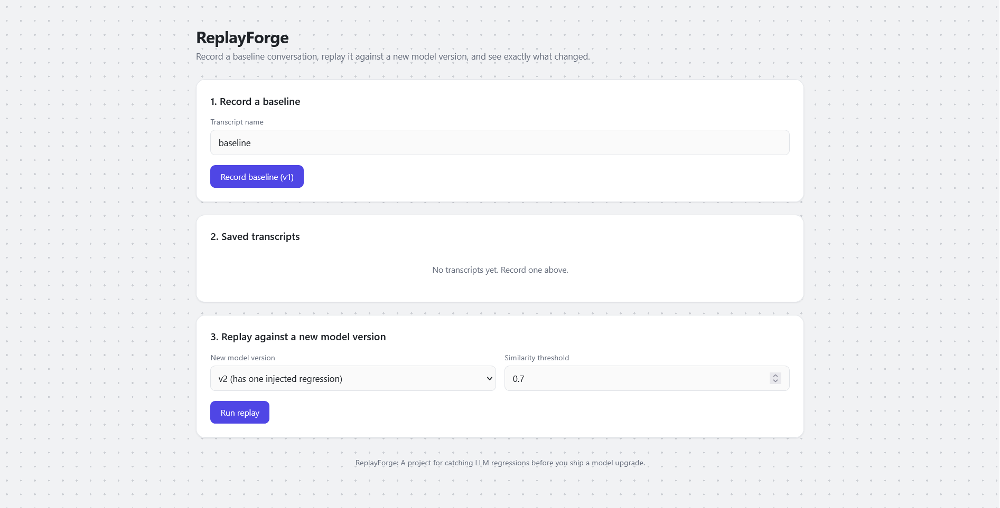
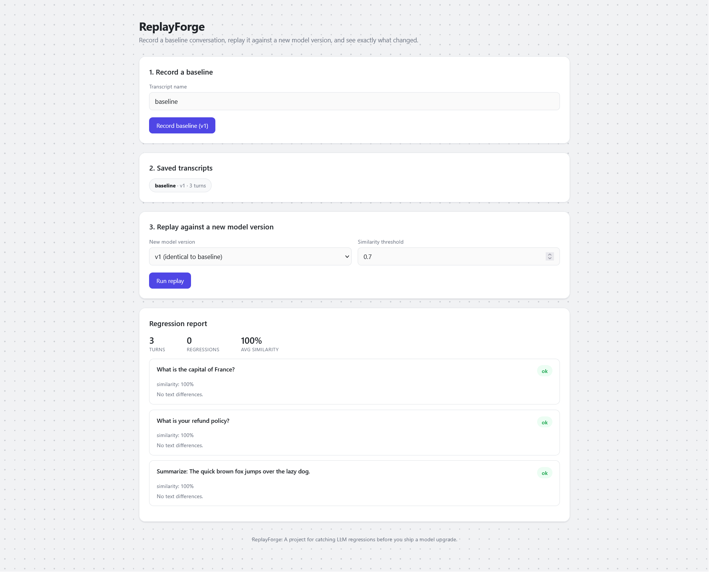
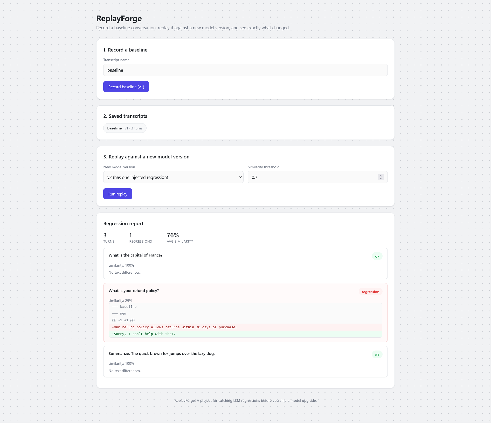
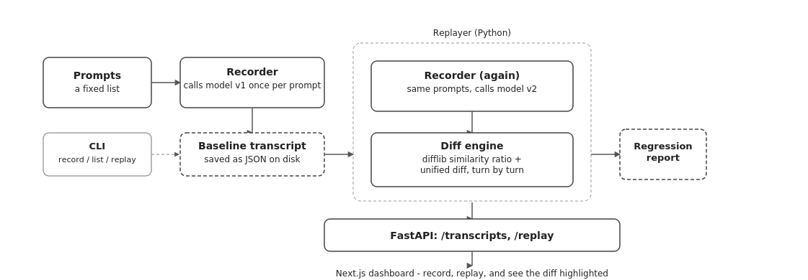

<h1 style="font-size: 13pt;">ReplayForge</h1>

ReplayForge is a simple tool that helps you test AI model updates.

When you update an AI model, some answers can quietly get worse. You might not notice this until users complain. ReplayForge records conversations with the old model, sends the exact same questions to the new model, and compares the answers side by side. If an answer changes too much, the tool flags it for you.

This project has two parts:

<ul>
  <li>A Python backend that records, replays, and compares answers.</li>
  <li>A Next.js dashboard that highlights the differences.</li>
</ul>

<h2 style="font-size: 13pt;">Why I built this</h2>

I built this project to practice three skills:

<ul>
  <li>Saving and loading structured data files.</li>
  <li>Comparing text to find changes.</li>
  <li>Building a command line tool with commands and arguments.</li>
</ul>

You can read more about these choices in the case-study.md file.

<h2 style="font-size: 13pt;">Screenshot</h2>

<h2 style="font-size: 13pt;">How it works</h2>

<ol>
  <li><strong>Record</strong>: ReplayForge sends prompts to your model and saves the questions and answers to a file.</li>
  <li><strong>Replay</strong>: ReplayForge sends the exact same prompts to a new model version.</li>
  <li><strong>Compare</strong>: The diff engine compares the old and new answers line by line.</li>
  <li><strong>Report</strong>: Any turn with big changes is flagged as a regression.</li>
</ol>

<h2 style="font-size: 13pt;">Project structure</h2>

<pre><code>replayforge/
  backend/
    replayforge/            -> main logic (recorder, diff engine, replayer)
    api.py                  -> FastAPI web server
    cli.py                  -> command line tool
    tests/                  -> unit tests
    requirements.txt
  frontend/
    app/                    -> Next.js web pages
    package.json
  docs/
    architecture-diagram.png
    dashboard-screenshot.png
  README.md
  case-study.md
</code></pre>

<h2 style="font-size: 13pt;">Running it yourself</h2>

<h3 style="font-size: 13pt;">1. Backend</h3>

<pre><code>cd backend
pip install -r requirements.txt
uvicorn api:app --reload --port 8000
</code></pre>

Check if the server is running at http://127.0.0.1:8000/health.

You can also run commands directly from your terminal:

<pre><code>python cli.py record --name baseline --model-version v1
python cli.py list
python cli.py show baseline
python cli.py replay --baseline baseline --model-version v2 --threshold 0.7
</code></pre>

<h3 style="font-size: 13pt;">2. Frontend</h3>

<pre><code>cd frontend
npm install
npm run dev
</code></pre>

Open http://localhost:3000 in your browser to view the dashboard.

<h3 style="font-size: 13pt;">3. Tests</h3>

<pre><code>cd backend
pytest
</code></pre>

<h2 style="font-size: 13pt;">Using a real LLM</h2>

By default, the project uses fake demo models so it costs no money and needs no setup.

To use a real AI model, write your own function like this:

<pre><code>def my-model(prompt: str) -> str:
    # call your AI model and return the text response
    pass
</code></pre>

Pass your function to the runner instead of the demo functions.

<h2 style="font-size: 13pt;">Settings</h2>

<table style="font-size: 12pt;">
  <thead>
    <tr>
      <th>Setting</th>
      <th>Meaning</th>
    </tr>
  </thead>
  <tbody>
    <tr>
      <td>Similarity threshold</td>
      <td>How close the new answer must be to the old answer (from 0 to 1).</td>
    </tr>
    <tr>
      <td>Model version</td>
      <td>The name of the model you are testing.</td>
    </tr>
  </tbody>
</table>

<h2 style="font-size: 13pt;">What this project does not do</h2>

<ul>
  <li>It does not make paid API calls by default.</li>
  <li>It compares text similarity, not factual correctness.</li>
  <li>It saves files on disk instead of using a database.</li>
</ul>

<h2 style="font-size: 13pt;">Tech used</h2>

<ul>
  <li>Python, FastAPI, Pytest</li>
  <li>Next.js, React, CSS</li>
</ul>

